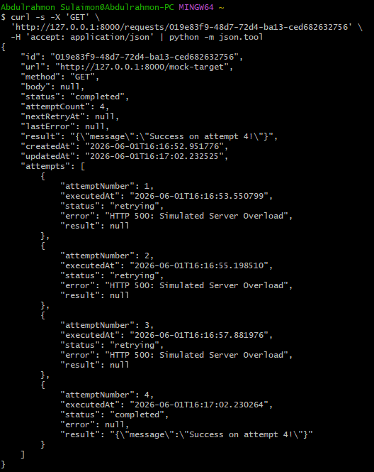

# Retry Engine

An asynchronous HTTP retry engine and background worker built with FastAPI and SQLite. This service buffers unreliable external API calls, handling transient network failures by automatically queuing and retrying failed requests using exponential backoff and randomized jitter.

---


## Setup

```bash
uv sync
uv run fastapi dev app/main.py
uv run python app/demo.py
```

## API

```bash
# Submit a request
curl -X POST http://127.0.0.1:8000/request \
  -H "Content-Type: application/json" \
  -d '{"url": "http://httpbin.org/status/503", "method": "GET", "maxRetries": 5, "backoffMs": 1000}'

# Get status & history
curl -X GET http://127.0.0.1:8000/requests/{id}

# Filter by status: pending | retrying | completed | failed
curl -X GET "http://127.0.0.1:8000/requests?status=pending"
curl -X GET "http://127.0.0.1:8000/requests?status=retrying"
curl -X GET "http://127.0.0.1:8000/requests?status=completed"
curl -X GET "http://127.0.0.1:8000/requests?status=failed"
```

## Architecture

```text
┌────────────┐
│   Client   │
└─────┬──────┘
      │ 1. POST /request (Submit Job)
      │    GET /requests (Check Status)
      ▼
┌──────────────────┐
│  FastAPI Router  │
└─────┬────────────┘
      │ 2. Save/Read Job State (PENDING)
      ▼
┌──────────────────────────────────────────────┐
│               SQLite Database                │
└─────┬─────────────────────────────────▲──────┘
      │ 3. Polls due rows               │
      │    (pending/retrying)           │
      ▼                                 │ 5. Update Job
┌──────────────────┐                    │    Status & History
│ Async Worker Loop│ ───────────────────┘
└─────┬────────────┘
      │ 4. Executes HTTP Call
      ▼
┌──────────────────┐
│   External API   │
└─────┬────────────┘
      │
      ├─► [ 200 OK ] ──────► Mark COMPLETED
      │
      ├─► [ 5xx/Timeout ] ─► Calc Backoff + Jitter
      │                      (Set nextRetryAt)
      │
      └─► [ 4xx Error ] ───► Mark FAILED
                             (Dead-letter)
```

## Backoff & Jitter

Doubles wait time after each failure (1s → 2s → 4s → 8s) so that the server will have enough time to possibly recover. A random multiplier (0.8–1.2) scatters retry timing across requests, preventing sudden multiple requests.

## Error Handling

- **5xx / timeouts** → retry (likely self-resolving)
- **4xx** → dead-letter immediately (bad request, retrying won't help)

## GET /requests/:id

- Screenshot: 
- Demo video: _[Demo Link](https://youtu.be/uUlvNG5tTCc)_


## Reflection

**Struggles:** Trying to conceptualize the entire implementation and hooking the worker with the entire web app. Also, visualizing how to handle repeated HTTP request failures.


**Lessons:** I learned to break complex systems into a simplified architecture. I now understand how to handle API failure, and recover efficiently without causing crashes.


## Resources

- [Exponential Backoff and Jitter (AWS Architecture Blog)](https://aws.amazon.com/blogs/architecture/exponential-backoff-and-jitter/)
- [Timeouts, Retries, and Backoff with Jitter (AWS Builders' Library)](https://aws.amazon.com/builders-library/timeouts-retries-and-backoff-with-jitter/)
- [Retrying and Exponential Backoff (HackerOne)](https://www.hackerone.com/blog/retrying-and-exponential-backoff-smart-strategies-robust-software)


## Why this project made me a better backend developer

Through this project, I now understand how to handle external server failure properly and efficiently. I also learnt to write defensively to handle and anticipate API instability, possible failure points gracefully when dealing with an external API.
